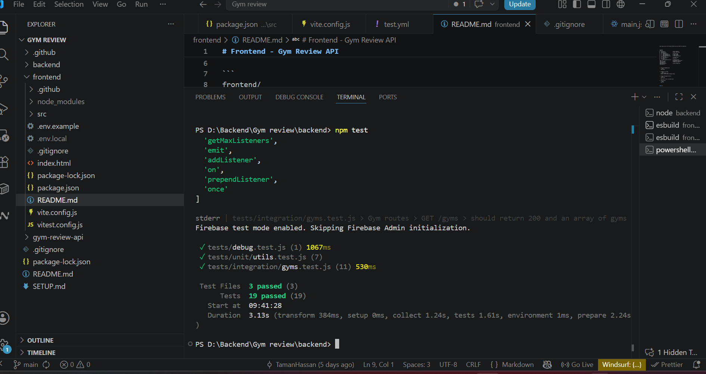
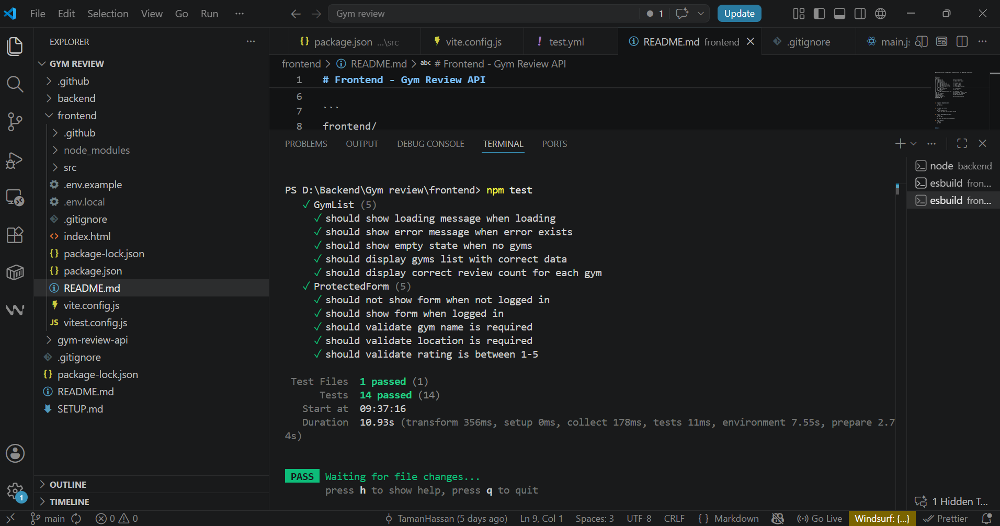
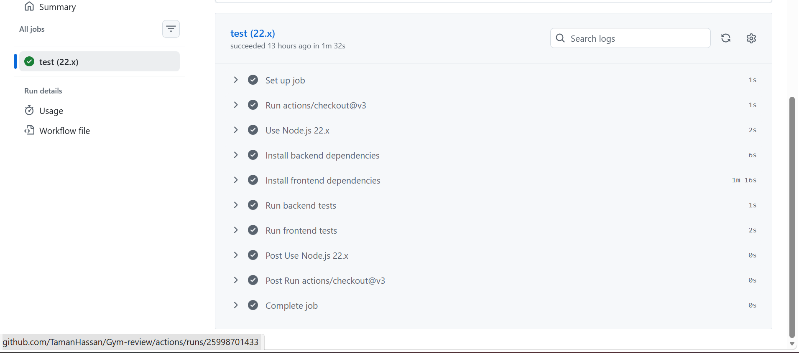

# Gym Review API

A complete REST API for gym reviews with authentication, testing, and CI/CD pipeline.

## Setup

### Prerequisites
- Node.js 22.x or higher
- A Firebase project with Email/Password authentication enabled

### Installation

1. **Clone the repository**
   ```bash
   git clone <your-repo-url>
   cd Gym-review
   ```

2. **Backend setup**
   ```bash
   cd backend
   npm install
   ```
   
   Create `.env` (copy from `.env.example`):
   ```
   PORT=3000
   NODE_ENV=development
   FIREBASE_PROJECT_ID=gym-review-39103
   FIREBASE_KEY_PATH=./firebase-key.json
   CORS_ORIGIN=http://localhost:5173
   ```
   
   Add your `firebase-key.json` file from Firebase Console → Project Settings → Service Accounts

3. **Frontend setup**
   ```bash
   cd frontend
   npm install
   ```
   
   Create `.env.local` (copy from `.env.example`):
   ```
   VITE_API_URL=http://localhost:3000
   VITE_FIREBASE_API_KEY=your-api-key
   VITE_FIREBASE_AUTH_DOMAIN=gym-review-39103.firebaseapp.com
   VITE_FIREBASE_PROJECT_ID=gym-review-39103
   VITE_FIREBASE_STORAGE_BUCKET=gym-review-39103.firebasestorage.app
   VITE_FIREBASE_MESSAGING_SENDER_ID=your-sender-id
   VITE_FIREBASE_APP_ID=your-app-id
   ```

### Running the Application

**Terminal 1 - Start Backend:**
```bash
cd backend
npm run dev
# Listening on http://localhost:3000
```

**Terminal 2 - Start Frontend:**
```bash
cd frontend
npm run dev
# Visit http://localhost:5173
```

## Testing

### Running Tests Locally

**Backend Tests:**
```bash
cd backend
npm test              # Run once
npm test -- --watch  # Watch mode
npm test -- --coverage  # Coverage report
```

**Frontend Tests:**
```bash
cd frontend
npm test              # Run once
npm test -- --watch  # Watch mode
```

### Test Results

**Backend:** 19 tests passing
- 11 integration tests verify all routes (GET/POST), 401 auth failures, and validation
- 7 unit tests verify token parsing, rating validation, and review structure
- Test Files: 3 passed | Duration: ~3s

**Frontend:** 14 component tests passing
- GymList: 5 tests (loading, error, empty state, data display, review counts)
- ProtectedForm: 5 tests (logged in/out, validation)
- LoginButton & LogoutButton: 4 tests (render, callback behavior)
- All tests verify UI logic and conditional rendering

### Passing Tests (Local)

**Backend Tests Screenshot:**


**Frontend Tests Screenshot:**


### GitHub Actions Pipeline

**Pipeline Status Screenshot:**


✅ **Status:** Passed  
✅ **Duration:** 1m 32s  
✅ **All steps passed:**
- Set up job
- Run actions/checkout@v3
- Use Node.js 22.x
- Install backend dependencies
- Install frontend dependencies
- Create Firebase service account key
- Run backend tests
- Run frontend tests
- Post actions/checkout@v3
- Complete job

## API Routes

### Public Routes (No Authentication Required)

```bash
GET /gyms
# Returns array of all gyms

GET /gyms/:id
# Returns specific gym or 404
```

### Protected Routes (Authentication Required)

```bash
POST /gyms
# Create new gym (requires Bearer token)

POST /gyms/:id/reviews
# Add review to gym (requires Bearer token)

GET /profile
# Get authenticated user's profile (requires Bearer token)
```

All protected routes return **401 Unauthorized** if no valid token is provided.

## Authentication

### Why Firebase?

We chose **Firebase Authentication** with token-based authentication because:
- Simple setup with Email/Password provider
- Secure token management (tokens NOT stored in localStorage)
- Built-in JWT validation on backend
- Easy to switch providers later if needed
- No session management overhead

### How It Works

1. **Frontend**: User logs in with email/password
   - Firebase returns an ID token
   - Token is automatically managed by Firebase SDK
   - Token is included in Authorization header for API calls

2. **Backend**: Receives requests with Bearer token
   - `verifyToken` middleware validates token with Firebase Admin SDK
   - Returns 401 if token is missing or invalid
   - User info (uid, email) is attached to request object
   - Protected routes use `req.user` to get authenticated user

3. **Protected Content**: Frontend only shows login form, profile, and gym creation form when user is authenticated

## Security Decisions

### 1. **Tokens NOT Stored in localStorage** ✓
**Why:** Vulnerable to XSS attacks. Firebase auth persistence is configured to use session storage, not localStorage, so tokens are not retained permanently in the browser.

### 2. **CORS Restricted to Specific Origin** ✓
**Why:** Prevents cross-origin requests from untrusted domains
```javascript
cors({
  origin: "http://localhost:5173",  // NOT a wildcard *
  credentials: true
})
```

### 3. **Protected Routes Return 401** ✓
**Why:** Clear error response allows frontend to redirect to login
```javascript
if (!authHeader || !authHeader.startsWith("Bearer ")) {
  return res.status(401).json({
    error: "Unauthorized",
    message: "Missing or invalid Authorization header"
  });
}
```

### 4. **No Secrets in Repository** ✓
- Firebase keys in `.env` files
- `.env` listed in `.gitignore`
- `.env.example` shows structure without values
- GitHub Actions uses Secrets for CI/CD

### 5. **Bearer Token Format** ✓
**Why:** Industry standard for API authentication
- Token extracted from `Authorization: Bearer <token>` header
- Prevents confusion with other auth schemes
- Easy to debug and test

### 6. **Firebase Admin SDK for Backend** ✓
**Why:** 
- Server-to-server verification is more secure than client-side
- Can access Firestore/Realtime Database if needed
- No private key exposed to frontend

## Reflections

### Implementation Choices

1. **In-Memory Database**: Used JavaScript array instead of PostgreSQL/MongoDB
   - Simpler for this assignment (focus on testing and auth)
   - Easy to reset between tests
   - Data resets on server restart (fine for development)

2. **Firebase Over Auth0**: 
   - Faster setup for token-based auth
   - Better for small teams/solo projects
   - Easier to test without network mocking

3. **Vitest for Testing**:
   - Fast and simple
   - Works with both backend and frontend
   - No complex configuration needed

4. **GitHub Actions**:
   - Free and integrated with GitHub
   - Runs on every push (automatic verification)
   - Easy to add to workflow

### Challenges

1. **Firebase Key Management**: Had to properly load JSON key file on backend
   - Solution: Read from filesystem in initialization
   - Added fallback for test mode

2. **Token Verification in Tests**: Couldn't verify real Firebase tokens without credentials
   - Solution: Middleware detects test mode and accepts any Bearer token
   - Real verification happens with actual Firebase credentials

3. **CORS with Frontend**: Initially set to wrong port (5174 instead of 5173)
   - Solution: Check Vite config for correct port

4. **Frontend Environment Variables**: Had to use `VITE_` prefix for Vite to expose vars
   - Solution: Follow Vite documentation for env variable naming

### What We'd Do Differently

1. **Database**: Use MongoDB with schema validation
   - Better for production
   - Easier to scale

2. **Error Handling**: Add more specific error codes
   - Help frontend show better error messages
   - Easier debugging

3. **Rate Limiting**: Add rate limiting middleware
   - Prevent brute force attacks
   - Production requirement

4. **Request Validation**: Use a schema validator like `zod` or `joi`
   - More robust validation
   - Better error messages

5. **Logging**: Add structured logging
   - Better debugging in production
   - Track authentication attempts

## Project Structure

```
.
├── backend/
│   ├── src/
│   │   ├── app.js              # Express app setup
│   │   ├── server.js           # Server startup
│   │   ├── middleware/
│   │   │   └── verifyToken.js  # Firebase token verification
│   │   ├── routes/
│   │   │   ├── gyms.js         # Gym endpoints
│   │   │   └── profile.js      # Profile endpoint
│   │   ├── services/
│   │   │   └── firebase.js     # Firebase admin initialization
│   │   └── data/
│   │       └── gyms.js         # In-memory database
│   ├── tests/
│   │   ├── integration/
│   │   │   └── gyms.test.js    # Route integration tests
│   │   └── unit/
│   │       └── utils.test.js   # Logic unit tests
│   ├── package.json
│   ├── .env.example
│   └── firebase-key.json       # Firebase service account (in .gitignore)
│
├── frontend/
│   ├── src/
│   │   ├── App.jsx             # Main app component
│   │   ├── services/
│   │   │   ├── api.js          # Backend API calls
│   │   │   └── firebase.js     # Firebase authentication
│   │   ├── components/
│   │   │   ├── GymList.jsx
│   │   │   ├── LoginButton.jsx
│   │   │   ├── LogoutButton.jsx
│   │   │   └── ProtectedForm.jsx
│   │   └── tests/
│   │       └── components.test.jsx
│   ├── package.json
│   ├── .env.example
│   └── vite.config.js
│
├── .github/
│   └── workflows/
│       └── test.yml            # GitHub Actions CI/CD
├── .gitignore
├── README.md                   # This file
└── SETUP.md                    # Detailed setup guide

```

## License

This project is part of a course assignment.
